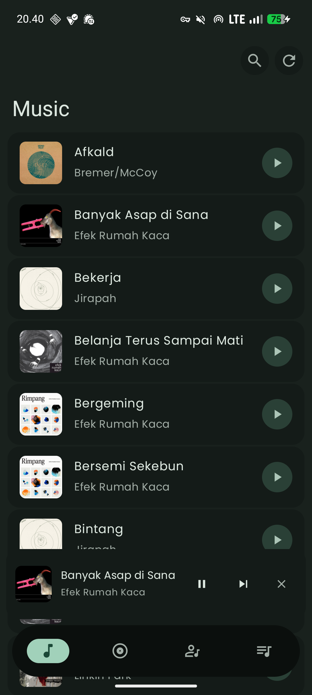
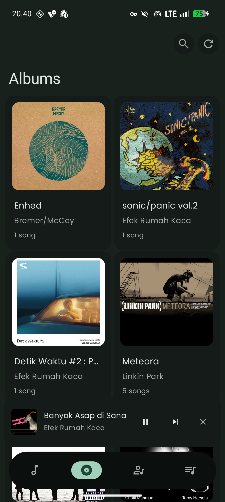
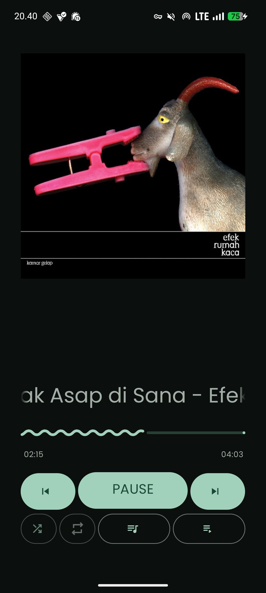

[](https://github.com/alfahrelrifananda/melody/releases)
[](https://developer.android.com)
[](LICENSE)

# Melody

A music player app for your local music collection with Material 3 design.

[](https://github.com/alfahrelrifananda/melody/releases)

## Features

- Play music from your device's storage
- Material 3 interface with dynamic color theming
- Standard player controls (play, pause, skip, shuffle, repeat)
- Background playback with notification controls
- Optimized for performance

## Screenshots

<div style="display: flex; justify-content: space-around; gap: 10px;">
  
  
  
</div>

## Tech Stack

- **Language:** Java
- **UI:** XML Layouts
- **Design:** Material 3 with Dynamic Colors
- **Media:** MediaPlayer & MediaSession
- **Architecture:** Native Android

## Getting Started

### Prerequisites

- [Android Studio](https://developer.android.com/studio) (latest stable version)
- Android device or emulator (API 24+)

### Installation

1. Clone the repository:
   ```bash
   git clone https://github.com/alfahrelrifananda/melody.git
   cd melody
   ```
2. Open the project in Android Studio.
3. Build and run the app.
4. Grant storage permissions to access your music files.

## Contributing

If you'd like to contribute:
- Fork the project
- Open issues for bugs or feature requests
- Submit pull requests

## Translations

Melody is currently available in English. If you want to add more languages, open an issue or submit a pull request with translation files.

## License

This project is licensed under the **GNU General Public License v3.0**. See the [LICENSE](LICENSE) file for details.
